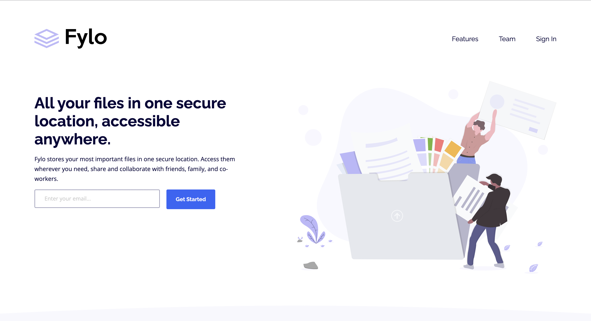

# Frontend Mentor - Fylo landing page with two column layout solution

This is a solution to the [Fylo landing page with two column layout challenge on Frontend Mentor](https://www.frontendmentor.io/challenges/fylo-landing-page-with-two-column-layout-5ca5ef041e82137ec91a50f5). Frontend Mentor challenges help you improve your coding skills by building realistic projects. 

## Table of contents

- [Overview](#overview)
  - [The challenge](#the-challenge)
  - [Screenshot](#screenshot)
  - [Links](#links)
- [My process](#my-process)
  - [Built with](#built-with)
- [Author](#author)
- [Acknowledgments](#acknowledgments)

## Overview

### The challenge

Users should be able to:

- View the optimal layout for the site depending on their device's screen size
- See hover states for all interactive elements on the page

### Screenshot

## My process

### Built with

- Semantic HTML5 markup
- CSS custom properties
- Flexbox
- CSS Grid
- Mobile-first workflow

## Author

- Website - [Lucky Ekpebe]
- Frontend Mentor - [@yourusername](https://www.frontendmentor.io/profile/Luckystartech)
- Twitter - [@yourusername](https://www.twitter.com/Lucky_Ekpebe)

## Acknowledgments

I appreciate the effort and dedication that the FrontendMentors team has put into creating these challenges and providing a platform for continuous learning and growth within the coding community. Your commitment to fostering a collaborative and supportive environment is commendable.

I look forward to taking on more challenges and learning opportunities on FrontendMentors in the future. Thank you for your dedication to the developer community and for being an essential part of my coding journey.
# fylo-landing-page-with-two-column-layout-master
